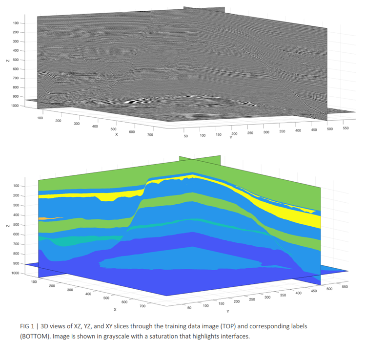
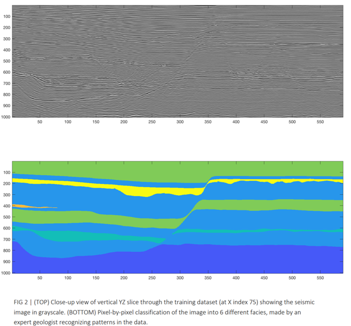
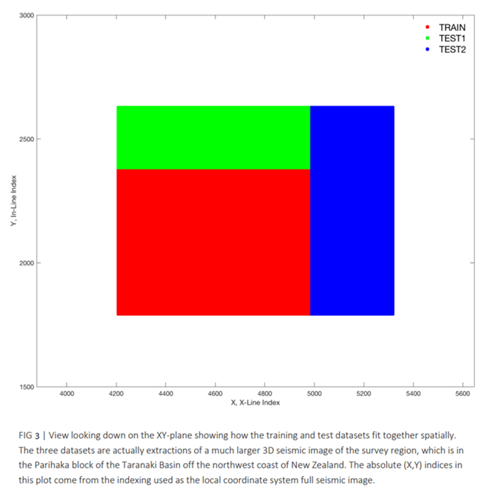
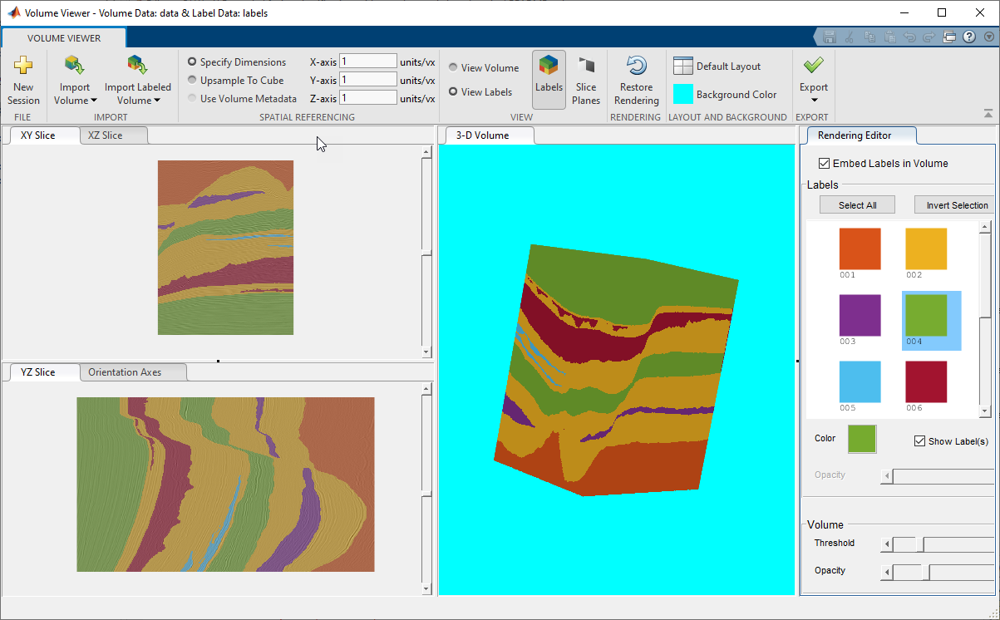

# Abstract
With the huge growth and complexity of seismic data, manual labeling of seismic facies has become a significant challenge. Recently, deep learning algorithms (particularly CNNs) have been used to simplify this task. In this submission, we demonstrate the advantage of using advanced signal processing techniques to preprocess signals before feeding them to deep learning algorithms. Our approach combines maximal overall discrete wavelet transform with recurrent neural networks (RNN) to improve the automated seismic facies analysis. This proposed framework generates more accurate results in a more efficient way. The combination of RNN with wavelets achieves more accurate results than just using CNNs. The results were demonstrated in a recent [SEAM hackathon](https://seg.org/News-Resources/News/page/ai-applied-geoscience-hackathon-results-released) organized by SEAM where the MathWorks&reg; team was ranked at the top – our F1 scores on test data were significantly higher than other teams

For more details about the methodology, please refer to this [MathWorks blogspot](https://blogs.mathworks.com/deep-learning/2021/08/03/mathworks-wins-geoscience-ai-gpu-hackathon/).

## Datasets
The datasets can be downloaded from [here](https://public.3.basecamp.com/p/JyT276MM7krjYrMoLqLQ6xST). Parihaka 3D Volume Data provided by New Zealand Petroleum and Minerals (NZPM). The associated labels and data for machine learning have been made available by Chevron U.S.A. Inc. 

The data for the challenge is divided into 3 pieces, with each piece (dataset) representing a 3D image of a different region of the subsurface in the area surveyed. Each dataset represents the image as a 3D array (matrix) of single-precision real numbers—e.g., as IMAGE(i,j,k), where index i runs from 1 to NZ (1:NZ), the number of image samples in the depth (Z) direction, while j and k run from 1:NX and 1:NY , the number of samples in the X and Y directions, respectively. The value stored in the array location IMAGE(i,j,k) is a real number (positive or negative), representing the strength of the echo returned to the surface from the spatial location in the Earth represented by the indices (i,j,k).

The training data set is a 3D image represented as a matrix of size 1006x782x590 real numbers stored in the order (Z, X, Y). Labels corresponding to the training data are similarly arranged and consist of integers with values ranging between 1 to 6. Figure 1 shows the 3D view of the seismic survey data of XZ, YZ and XY slices and corresponding labels. Figure 2 below shows the intensity plot of the echoes and the corresponding labels for each pixel in one 2D cross-sectional view of an XZ slice. Details about the corresponding facies can be read at the link mentioned above. 

The test datasets represent 3D images to be classified by a deep learning algorithm (after supervised training using the training data set and labels). The test dataset 1 is 1006 × 782 × 251 in size and borders the training image at North (Figure 3). The test dataset 2 is 1006 × 334 × 841 in size and borders the training image at East (Figure 3).

## Importing the datasets into MATLAB
To read the SEG-Y files into MATLAB&trade;, download and use [this application](https://sourceforge.net/projects/segymat/). Unzip the folder and add it to the MATLAB&trade; path. 
Use the following commands to read the 'TrainingData_Image.segy' file into MATLAB

`[data_train,SegyTraceHeaders,SegyHeader]=ReadSegy('TrainingData_Image.segy');` 

`[labels_train,SegyTrace,SegyHead]=ReadSegy('TrainingData_Labels.segy');`

`data_train = reshape(data_train,1006,782,590);`

`labels_train = reshape(labels_train,1006,782,590);`

To save it as a .mat file, use the following commands

`save data_train.mat -v7.3`

`save labels_train.mat -v7.3`

Saving as mat files of size > 1.5 GB takes some time but is recommended since you will be directly working on these files.

Use equivalent commands to import, read and save the remaining data sets.

## Visualizing the dataset
Use the Volume Viewer app to visualize the training dataset with the labels.  Using this app, you can view the data as a volume or as plane slices. You can also view the data as a maximum intensity projection or an isosurface. Using the Rendering Editor component you can manipulate opacity to see the structures in the volume that you want to see and make transparent those structures in the volume that you do not want to see.

To open the data in Volume Viewer app run the following command: 

`volumeViewer(data_train, labels_train)`

## Training
Run the `RNNClassificationTraining.mlx` script to run the model training.  This script extracts the maximal overlap discrete wavelet transform from the training dataset and trains a biLSTM RNN model for classification.  The details on the methodology are available in the [MathWorks blogspot](https://blogs.mathworks.com/deep-learning/2021/08/03/mathworks-wins-geoscience-ai-gpu-hackathon/).

## Testing
Run the `RNNClassificationTesting.mlx` function to use it as a classifier for any test data.  This function extracts the wavelets based features and runs the classification on a trained RNN model.  The output of the function is the labels 3D matrix with dimensions same as the input data.  

## Products needed
1. MATLAB&trade;
2. Deep Learning Toolbox&trade;
3. Wavelets Toolbox&trade;
4. Parallel Computing Toolbox&trade;
5. Computer Vision Toolbox&trade;

## Hardware used
The training was performed on a single NVIDIA&reg; Ampere A100 GPU using the MATLAB&reg; AWS&reg; Reference architecture cloud image. This can be [found here](https://github.com/mathworks-ref-arch/matlab-on-aws).

##
_The license is available in the License file within this repository_

_Copyright 2021 The MathWorks, Inc._

